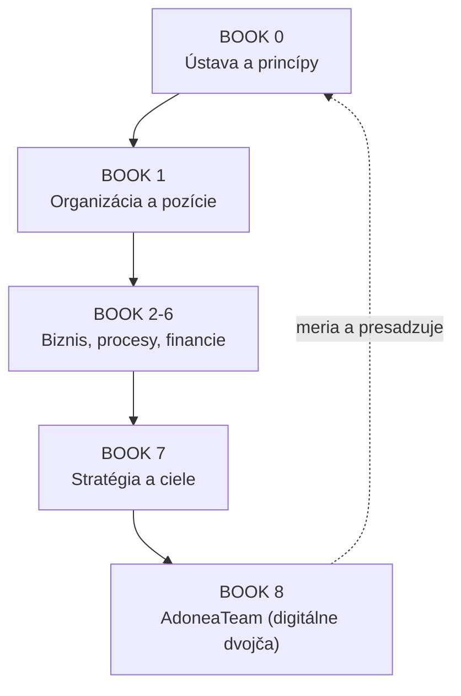

# ADONEA – Operačný systém firmy (ucelený prehľad)

## Metadáta

- **ID:** AOS-000
- **Typ dokumentu:** Ucelený prehľad operačného systému
- **Verzia:** 1.0
- **Stav:** Living (živý prehľadový dokument)
- **Vlastník:** CEO (POS-001)
- **Dátum:** 2026-07-19

---

## 1. Čo je ADONEA Operačný systém

ADONEA Operačný systém (AOS) je spôsob, akým firma vedome funguje: jej princípy, organizácia, procesy, financie, stratégia a digitálne dvojča. Nie je to jeden nemenný manuál, ale živý systém rozhodnutí zapísaných v tomto repozitári.

Tento dokument je **jednotný vstupný bod**. Nekopíruje obsah jednotlivých kníh — odkazuje naň, aby existoval jeden zdroj pravdy (viď pravidlo zdroja pravdy nižšie). Kto chce pochopiť firmu za 10 minút, číta tento dokument. Kto potrebuje detail, ide do príslušnej knihy.

---

## 2. Základná logika systému

Systém je postavený na štyroch prepojených tvrdeniach:

1. **Najskôr firma, potom softvér.** AIOS sa tvorí nad schválenými pravidlami firmy, nie naopak.
2. **Aplikácia je digitálne dvojča firmy.** Čo nie je v systéme, nie je z pohľadu firmy spoľahlivo riadené (ADR-062).
3. **Firma je definovaná katalógom pozícií, nie ľuďmi.** Karty existujú nezávisle od osôb a presúvajú sa pri raste (ADR-060, ADR-061).
4. **Charakter pred výsledkami.** Rast nesmie poškodiť dôveru, kvalitu ani kultúru (ADR-051).

Rozhodnutia tečú zhora nadol (princíp → organizácia → proces → cieľ), aplikácia ich dole presadzuje a hore meria pravdu.

---

## 3. Mapa kníh

| Kniha | Obsah | Stav |
|---|---|---|
| [BOOK 0 – Constitution](BOOK-0-CONSTITUTION/README.md) | ADR-051–062, AOM/AIOS rámec, register rozhodnutí | rozpracované |
| [BOOK 1 – Organization](BOOK-1-ORGANIZATION/README.md) | 11 organizačných oblastí, katalóg pozícií, karty | katalógy Accepted |
| BOOK 2 – Business | produkty, služby, obchodné modely | plánované |
| BOOK 3 – Knowledge | firemné know-how, znalostná báza | plánované |
| BOOK 4 – Automation | automatizácie a AI agenti | plánované |
| BOOK 5 – Resources | majetok, technika, logistika | plánované |
| BOOK 6 – Finance | financie, reporting, controlling | plánované |
| [BOOK 7 – Strategy](BOOK-7-STRATEGY/README.md) | ciele a KPI na 1–5 rokov | Proposed |
| [BOOK 8 – AdoneaTeam](BOOK-8-ADONEATEAM/README.md) | baseline aplikácie, roadmapa z OS | baseline Accepted, roadmapa Proposed |

Kostra AOM (kapitoly 00–08) je schválená a nemení sa bez objektívneho dôvodu potvrdeného praxou.

---

## 4. Firma v skratke

**Čo Adonea robí:** montáž lokálnych rekuperácií, montáž klimatizácií, jadrové vŕtanie a rezanie betónu, lepenie protislnečných a bezpečnostných fólií; k tomu maloobchod a veľkoobchod. Služby, maloobchod a veľkoobchod sa riadia ako odlišné obchodné modely.

**Ako získava prácu:** najmä cez platený marketing → lead → kvalifikácia a follow-up → obhliadka → ponuka → objednávka → plánovanie → realizácia → protokol → fakturácia → úhrada → starostlivosť a opakovaný obchod.

**Ako je organizovaná:** 11 trvalých organizačných oblastí (ORG-01–11), v nich katalóg pozícií (POS-001–102). Dnes väčšinu kariet drží zakladateľ; rast znamená presun kariet, nie novú organizáciu.

---

## 5. Kam firma smeruje

Detail je v [BOOK 7 – STRAT-001](BOOK-7-STRATEGY/01-CIELE-A-MERATELNE-UKAZOVATELE-2026-2031.md). V skratke:

- **North Star:** zdravý ziskový rast = uhradené tržby × marža × dodané záväzky voči zákazníkovi.
- **Míľniky:** > 1 M € do 2 rokov, > 5 M € do 5 rokov, marža rastúca k ≥ 35 %.
- **Päť pilierov:** dopyt a obchod, realizácia a kvalita, financie a hotovosť, zákazník a opakovaný obchod, organizácia a systém.

---

## 6. Aplikácia ako digitálne dvojča

AdoneaTeam (`github.com/vytapetujem/adonea`) už pokrýva CRM, projekty, montáže, protokoly, financie, banku, HR, AI a email/push. Baseline aj plán dokončenia sú v [BOOK 8](BOOK-8-ADONEATEAM/README.md).

Najbližšie priority vývoja (odvodené z OS a auditu):

1. Zjednotiť CRM stavy a bezpečnosť Edge Functions (Vlna 0).
2. SLA prvého kontaktu, povinný ďalší krok, prevod lead → projekt (Vlna 1).
3. Bankové párovanie s DPH, marža na zákazku, cash-flow forecast (Vlna 2).

---

## 7. Pravidlo zdroja pravdy

Rozhodnutie nie je záväzné, kým nie je zapísané v tomto repozitári a označené stavom. Ak sa prax líši od zápisu, platí zápis, rozdiel sa vyhodnotí a lepší postup vznikne ako nová verzia. Dôležité zmeny sa nezavádzajú iba ústne.

**Stavy dokumentov:** Draft → Review/Proposed → Accepted → Archivované/Nahradené.

---

## 8. Ako sa v systéme pracuje

1. Nevracať sa opakovane k návrhu kostry.
2. Nezačínať ďalší dokument, kým aktuálny nie je dokončený.
3. Používať existujúce materiály a neprepisovať ich bez dôvodu.
4. V každej relácii vytvoriť konkrétny hotový výstup.
5. Schválené rozhodnutia zapisovať do repozitára.
6. Meniť schválené rozhodnutia iba cez novú verziu.

---

## 9. Aktuálny stav a ďalší krok

**Hotové:** ústavné ADR, katalóg oblastí, katalóg pozícií, karta POS-021, SLA prvého kontaktu, stratégia s KPI (návrh), baseline aplikácie, roadmapa aplikácie (návrh), tento ucelený prehľad.

**Najbližšie kroky:**

1. Schváliť stratégiu (STRAT-001) a roadmapu (APP-ROAD-001) alebo upraviť čísla a priority.
2. Dopracovať proces `03.03-L1 Proces predaja` (BOOK 2/procesy).
3. Začať Vlnu 0 a 1 vývoja aplikácie cez repozitár `vytapetujem/adonea`.

---

## História zmien

| Verzia | Dátum | Zmena |
|---|---|---|
| 1.0 | 2026-07-19 | Prvý ucelený prehľad operačného systému firmy. |
